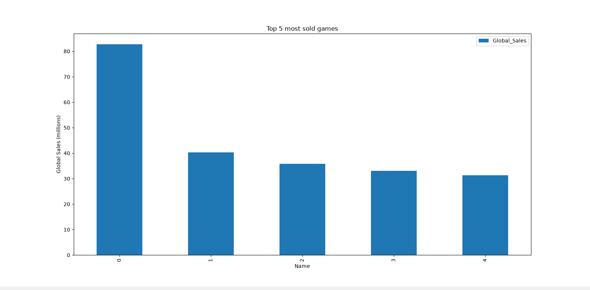
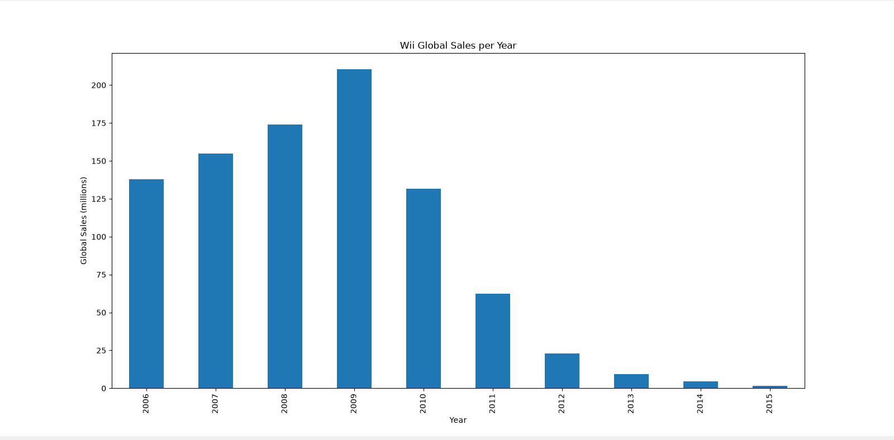
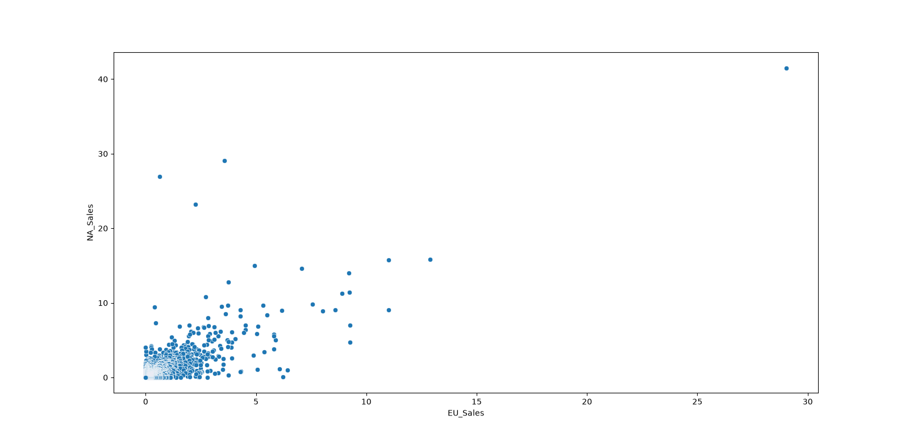
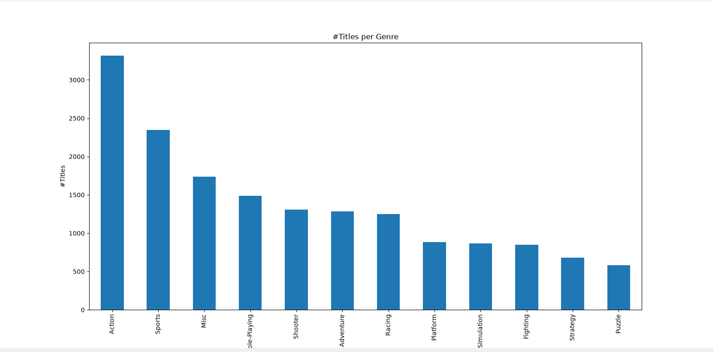

# 🎮 Video Game Sales — Exploratory Analysis (Python)

A short exploratory data-analysis project built in Python with **pandas**, **matplotlib**, and **seaborn**.
The goal was to answer four questions about the catalog by cleaning, filtering, aggregating,
and visualizing the data — and to make sure every chart actually *means* what its title claims.

## 📊 The data
- **Source:** Video Game Sales dataset (Kaggle).
- **Shape:** 16,598 rows × 11 columns (Rank, Name, Platform, Year, Genre, Publisher,
  and regional sales: NA, EU, JP, Other, Global — in millions of units).
- **Note:** `Year` is stored as float because of missing values; converted to a nullable
  integer (`convert_dtypes()`) for clean plotting.

## 🔍 Questions & findings

**1. What were the top 5 most sold games?**

Wii Sports leads by a wide margin (~82.7M global), followed by Super Mario Bros.,
Mario Kart Wii, Wii Sports Resort, and Pokémon Red/Blue. *(Confirmed via `nlargest`,
so this holds regardless of the file's row order.)*

**2. In what year did Wii sell the most?**

Filtered to Wii, grouped by year, summed global sales — so each bar is one year's total.
Wii sales peaked in **2009** after ramping from its 2006 launch, then declined through 2015.

**3. How do North-American sales compare with European sales?**

NA and EU sales move together (positive relationship),
but the cloud is jammed into the bottom-left: most titles sell little in both regions,
with a long tail of blockbusters out in the corner, meaning the catalog is heavily skewed.

**4. Which genre has the most titles?**

The genre with the most titles is Action with over 3000, followed by Sports, Misc, Role-Playing and Shooter. 

## 🛠️ Methods / skills used
- **Column & row selection** (bracket indexing, boolean masking — `Platform == 'Wii'`)
- **Aggregation** (`value_counts()` for counts; `groupby('Year').sum()` for yearly totals)
- **Ranking** (`nlargest`)
- **Visualization** (bar charts for categories/totals, scatter for two numeric columns)
- **Data-type cleaning** (`convert_dtypes()` for the nullable-integer year)

## ▶️ How to run
```bash
pip install pandas matplotlib seaborn
python videogame_sales.py 
